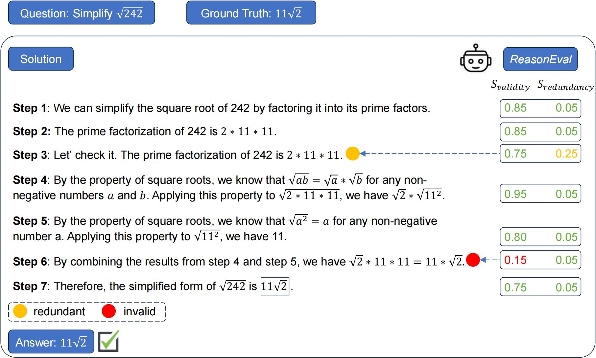

# Evaluating Mathematical Reasoning Beyond Accuracy
This repository presents the open-source resource associated with the paper [Evaluating Mathematical Reasoning Beyond Accuracy](). Specifically, we release the best-performing model, meta-evaluation script, and all evaluation results.

## Table of Contents
- [Introduction](#introduction)
- [Quick Start](#quick-start)
  - [Setup](#setup)
  - [Model](#model)
  - [Usage](#usage)
- [Meta Evaluation](#meta-evaluation)
  - [Datasets](#datasets)
  - [Code](#code)
- [Citation](#citation)

## Introduction
The leaderboard of Large Language Models in mathematical tasks has
been continuously updated. However, the majority of evaluations focus solely on
the final results, neglecting the quality of the intermediate steps. To measure reasoning beyond final-answer accuracy, we develop **ReasonEval**, a suite comprising a new evaluation methodology with defined metrics for assessing mathematical reasoning quality and corresponding LLM-based evaluators for automated calculation.   **ReasonEval** assesses the problem-solving process in a step-by-step format from the following perspectives:
- **Validity**: The step contains no mistakes in calculation and logic.
- **Redundancy**: The step lacks utility in solving the problem but is still valid.

<p align="center">

</p>

With ReasonEval, you can

- 📏 quantify the quality of reasoning steps free of human or close-source models.

- 🤖 find the potential invalid or redundant steps in the solutions even with the correct results.

- 🛠️ select high-quality training data for downstream tasks (e.g., fine-tuning).


## Quick Start
### Setup

* Clone the repository
```bash
git clone https://github.com/GAIR-NLP/ReasonEval
cd ReasonEval
```
* Create a conda environment and activate the environment
```bash
conda create -n ReasonEval python=3.10
conda activate ReasonEval
```
* Install the required libraries
```bash
pip install -r requirements.txt
```


### Model

ReasonEval is now available on huggingface-hub:

| Model Name | HF Checkpoint                                                | Size    | License | Fine-tuned from model |  
| ---------- | ------------------------------------------------------------ | ------- | ------------------------------------------------------------ | --------------------------- |
| ReasonEval-7B     | [🤗 GAIR/ReasonEval-7B](https://huggingface.co/GAIR/ReasonEval-7B) | **7B** | [Llama 2](https://ai.meta.com/resources/models-and-libraries/llama-downloads/) | [WizardMath-7B-V1.1](https://huggingface.co/WizardLM/WizardMath-7B-V1.1)|
| ReasonEval-34B    |[🤗 GAIR/ReasonEval-34B](https://huggingface.co/GAIR/ReasonEval-34B) | **34B** | [Apache License 2.0](https://www.apache.org/licenses/) | [llemma_34b](https://huggingface.co/EleutherAI/llemma_34b)|


### Usage

Provide the question and the solution in a step-by-step format.

```python
# examples
question = "Let $x,$ $y,$ and $z$ be positive real numbers such that $xyz(x + y + z) = 1.$  Find the minimum value of\n\\[(x + y)(y + z).\\]"
reasoning_steps = ["1. The problem asks us to find the minimum value of $(x + y)(y + z)$ given that $x,$ $y,$ and $z$ are positive real numbers and $xyz(x + y + z) = 1$.", 
"2. By the AM-GM inequality, we have $x + y + z \\geq 3\\sqrt[3]{xyz}$.", 
"3. By the given condition $xyz(x + y + z) = 1$, we can substitute $x + y + z$ with $\\sqrt[3]{xyz}$ in the inequality from step 2 to get $3\\sqrt[3]{xyz} \\geq 3$.",
"4. Simplifying the inequality from step 3 gives $\\sqrt[3]{xyz} \\geq 1$.",
"5. By raising both sides of the inequality from step 4 to the power of 3, we have $xyz \\geq 1$.",
"6. By the AM-GM inequality, we have $(x + y)(y + z) \\geq 2\\sqrt{(x + y)(y + z)}$.",
"7. By the given condition $xyz(x + y + z) = 1$, we can substitute $(x + y)(y + z)$ with $\\frac{1}{xyz}$ in the inequality from step 6 to get $2\\sqrt{(x + y)(y + z)} \\geq 2\\sqrt{\\frac{1}{xyz}}$.", 
"8. Simplifying the inequality from step 7 gives $(x + y)(y + z) \\geq \\frac{2}{\\sqrt{xyz}}$.", 
"9. By the condition $xyz \\geq 1$ from step 5, we have $\\frac{2}{\\sqrt{xyz}} \\geq \\frac{2}{\\sqrt{1}} = 2$.", 
"10. Therefore, the minimum value of $(x + y)(y + z)$ is $\\boxed{2}$."]
```

Run `./codes/examples.py` to get the validity and redundancy scores for each step.
```bash
# examples
## Replace the 'question' and 'reasoning_steps' in ./codes/examples.py with your own content.
python ./codes/examples.py
--model_name_or_path GAIR/ReasonEval-7B # Specify the model name or path here
--model_size 7B # Indicate the model size of ReasonEval (7B or 34B)
```

## Meta Evaluation
### Datasets
The datasets for meta-evaluations are composed of three parts:

- **Meta-Reasoning-MATH**: This dataset is constructed as follows:

  - To collect the first type of errors affecting the correctness of steps, we recruit undergraduates who have a solid mathematical background to label solutions generated by Abel and WizardMath. We collect 83 samples with incorrect steps and 76 without, pinpointing the first error location in the former. All the solutions reach the correct final answers, meaning the evaluators need to judge correctness based on the process rather than the outcome. Here is one annotated line
    ```javascript
    // ./dataset/mr-math_invalid_errors.json
    {
      // Instance ID.
      "id": 0, 
      // Question to which this solution responds.
      "question": "Convert the point $(0,3)$ in rectangular coordinates to polar coordinates.  Enter your answer in the form $(r,\\theta),$ where $r > 0$ and $0 \\le \\theta < 2 \\pi.$", 
      // Ground truth final answer for the problem.
      "ground_truth_answer": "\\left( 3, \\frac{\\pi}{2} \\right)", 
      // Model that generated the solution.
      "generator": "Abel13B-001", 
      // The raw solution.
      "model_output": "1. The problem asks us to convert the point $(0,3)$ in rectangular coordinates to polar coordinates. We need to express the answer in the form $(r, \\theta)$, where $r > 0$ and $0 \\le \\theta < 2\\pi$.\n2. To convert rectangular coordinates to polar coordinates, we need to find the magnitude $r$ and the angle $\\theta$.\n3. The magnitude $r$ is given by the formula $r = \\sqrt{x^2 + y^2}$, where $x$ and $y$ are the coordinates of the point. In this case, $x = 0$ and $y = 3$, so $r = \\sqrt{0^2 + 3^2} = 3$.\n4. The angle $\\theta$ is the angle between the positive $x$-axis and the line connecting the origin and the point. In this case, the line is vertical, so the angle is $90$ degrees or $\\frac{\\pi}{2}$ radians.\n5. [Final solution] Therefore, the polar coordinates of the point $(0,3)$ are $\\boxed{\\left(3, \\frac{\\pi}{2}\\right)}$.  #### \\left(3, \\frac{\\pi}{2}\\right) ", 
      // The solution in a step-by-step format. We first split the solution by the order number of the steps, and then separate the steps by '\n'.
      "model_output_step_format": [
        ["1. The problem asks us to convert the point $(0,3)$ in rectangular coordinates to polar coordinates. We need to express the answer in the form $(r, \\theta)$, where $r > 0$ and $0 \\le \\theta < 2\\pi$."], 
        ["2. To convert rectangular coordinates to polar coordinates, we need to find the magnitude $r$ and the angle $\\theta$."], 
        ["3. The magnitude $r$ is given by the formula $r = \\sqrt{x^2 + y^2}$, where $x$ and $y$ are the coordinates of the point. In this case, $x = 0$ and $y = 3$, so $r = \\sqrt{0^2 + 3^2} = 3$."], 
        ["4. The angle $\\theta$ is the angle between the positive $x$-axis and the line connecting the origin and the point. In this case, the line is vertical, so the angle is $90$ degrees or $\\frac{\\pi}{2}$ radians."], 
        ["5. [Final solution] Therefore, the polar coordinates of the point $(0,3)$ are $\\boxed{\\left(3, \\frac{\\pi}{2}\\right)}$."]
        ], 
      // The answer correctness.
      "model_output_answer_correctness": "correct", 
      // The correctness of the reasoning steps.
      "model_output_solution_correctness": "correct", 
      // The first error step of the solution, N/A if not applicable. Set 1 for the first step.
      "model_output_solution_first_error_step": "N/A"
    }
    ```

  - For the second type of errors affecting the efficiency of problem solving process, as they are more rarer than the first one, we sample solutions from the test set of [PRM800K](https://github.com/openai/prm800k) directly, containing 150 samples with redundant steps and 150 samples without. Here is one annotated line
    ```javascript
    // ./dataset/mr-math_redundant_errors.json
    {
      // Instance ID.
      "id": 0,
      // Question to which this solution responds.
      "question": "A steel sphere with a 3-inch radius is made by removing metal from the corners of a cube that has the shortest possible side lengths. How many cubic inches are in the volume of the cube?", 
      // Ground truth final answer for the problem.
      "ground_truth_answer": "216", 
      // Model that generated the solution.
      "generator": "GPT-4 (PRM800K)", 
      // The solution in a step-by-step format.
      "model_output_step_format": [
        ["The problem involves a sphere and a cube, so I will need to use the formulas for the volumes of these shapes."], 
        ["The volume of a sphere is V_s = (4/3)\u03c0r^3, where r is the radius."], 
        ["The volume of a cube is V_c = s^3, where s is the side length."], 
        ["I want to find the volume of the cube, so I need to express s in terms of r. The sphere is made by removing metal from the corners of the cube, so the sphere must fit snugly inside the cube, touching all six faces."], 
        ["This means that the diameter of the sphere is equal to the side length of the cube, or 2r = s."], 
        ["Now I can substitute 2r for s in the formula for the volume of the cube, and get V_c = (2r)^3 = 8r^3."], 
        ["The problem gives me the value of r as 3 inches, so I can plug that in and get V_c = 8(3)^3 = 8(27) = 216."], 
        ["Therefore, the volume of the cube is 216 cubic inches."], 
        ["# Answer\n\n216"]
      ],
      // The rating of each step. Can be 0 (neutral), or +1 (positive). 
      // The positive label indicates the step is correct and contributes to solving the question.
      // The neutral label represents that the step is also correct but does not make any progress. 
      "rating": [1, 1, 1, 1, 1, 1, 1, 1, 1]
    }
    ```
- **Meta-Reasoning-GSM8K**: This dataset consists of 3000 solutions from problems in GSM8K, including variations of code solutions and backward reasoning. For more details, see the official repository for [MR-GSM8K](https://github.com/dvlab-research/MR-GSM8K).
- **Perturbation**: We introduce 6 types of errors to one of the intermediate steps in the solutions from the test set of [PRM800K](https://github.com/openai/prm800k). Here is one annotated line
  ```javascript
  // ./dataset/perturbation.json
  {
    // Instance ID.
    "id": 0, 
    // Reference solution ID.
    "rid": 0, 
    // Question to which this solution responds.
    "question": "Three pencils and a jumbo eraser cost $\\$1.24$. Five pencils and a jumbo eraser cost $\\$1.82$. No prices include tax. In cents, what is the cost of a pencil?", 
    // Ground truth final answer for the problem.
    "ground_truth_answer": "29", 
    // Original solutions without any errors.
    "reference_steps": [
      "Let's call the price of a pencil p and the price of a jumbo eraser e. Then we can write two equations.", 
      "We have $3p+e=1.24$ and $5p+e=1.82$.",
      "To solve this system, let's subtract the first equation from the second equation. This will eliminate e.",
      "$5p+e-3p-e=1.82-1.24$.",
      "This simplifies to $2p=0.58$. So $p=0.29$.",
      "So the price of a pencil is 29 cents."
      ],
    // Perturbed solutions with error steps.
    "hypothesis_steps": [
      "Let's call the price of a pencil p and the price of a jumbo eraser e. Then we can write two equations.",
      "We have $3p+e=1.24$ and $5p+e=1.82$.",
      "To solve this system, let's subtract the first equation from the second equation. This will eliminate e.",
      "$5p+e-3p-e=1.15-1.24$.",
      "This simplifies to $2p=0.58$. So $p=0.29$.",
      "So the price of a pencil is 29 cents."
    ],
    // Types of errors. Can be 'random number', 'random operation', 'swap steps', 'remove step', 'repeat step' or 'swap solutions'.
    "error_type": "random number",
    // The error step in the perturbed solutions. Set 0 for the first step.
    // 'random number': [int] the step where the number is changed.
    // 'random operation': [int] the step where the operation is changed.
    // 'swap steps': [list] the swapped two steps.
    // 'remove steps': [int] the removed step in the reference solution.
    // 'repeat step': [int] the last step before the repeated step.
    // 'swap solutions': [int] the rid of the perturbed solution it originally belongs to.
    "tags": 3}
  ```
We provide the above datasets in `./dataset/`

### Code
To reproduce our results in the meta-evaluations, run the following commands:
```bash
python ./codes/mr-gsm8k_eval.py
python ./codes/mr-math_eval.py --error_type invalid
python ./codes/mr-math_eval.py --error_type redundant
```

### Citation
Please cite the paper if the resource in this repo or the paper is helpful to you.
```

```